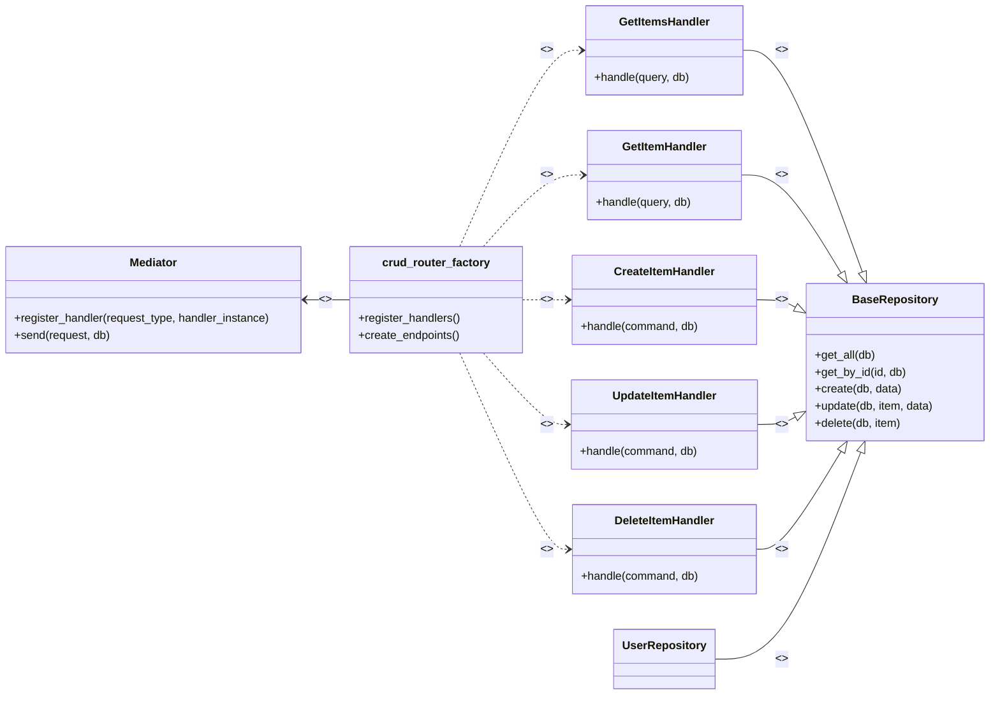
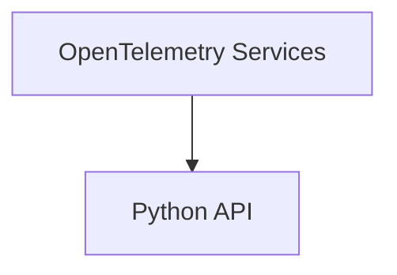

[](https://minimal-fastapi-postgres-template.rafsaf.pl/)
[](https://github.com/potlitel/minimal-fastapi-template/blob/main/LICENSE)
[](https://docs.python.org/3/whatsnew/3.13.html)
[](https://github.com/astral-sh/ruff)
[](https://github.com/rafsaf/minimal-fastapi-postgres-template/actions/workflows/tests.yml)


_Check out online example: https://minimal-fastapi-postgres-template.rafsaf.pl, it's 100% code used in template (docker image) with added my domain and https only._

# Minimal async FastAPI + PostgreSQL template

- [Minimal async FastAPI + PostgreSQL template](#minimal-async-fastapi--postgresql-template)
  - [Features](#features)
  - [API Architecture Diagram with MediatR and Repository Patterns](#api-architecture-diagram-with-mediatr-and-repository-patterns)
  - [Quickstart](#quickstart)
    - [1. Create repository from a template](#1-create-repository-from-a-template)
    - [2. Install dependecies with Poetry](#2-install-dependecies-with-poetry)
    - [3. To configure the database and migrations, make sure you are in the project root directory.](#3-to-configure-the-database-and-migrations-make-sure-you-are-in-the-project-root-directory)
      - [3.1 Setup database](#31-setup-database)
        - [3.1.1 Access Adminer](#311-access-adminer)
        - [3.1.2 Connect to the database](#312-connect-to-the-database)
        - [3.1.3 Login](#313-login)
      - [3.2 Setup migrations](#32-setup-migrations)
        - [3.2.1 Activate the virtual environment created in step 2](#321-activate-the-virtual-environment-created-in-step-2)
        - [3.2.1 Run Alembic migrations](#321-run-alembic-migrations)
    - [5. Observability and OpenTelemetry](#5-observability-and-opentelemetry)
    - [4. And this is it, now you can run app](#4-and-this-is-it-now-you-can-run-app)
    - [5. Docker deployment](#5-docker-deployment)
      - [5.1 How to Run a Dockerfile](#51-how-to-run-a-dockerfile)
      - [5.2 Ejecutar imagen Docker](#52-ejecutar-imagen-docker)
    - [5. Activate pre-commit](#5-activate-pre-commit)
    - [6. Running tests](#6-running-tests)
  - [About](#about)
  - [Step by step example - POST and GET endpoints](#step-by-step-example---post-and-get-endpoints)
    - [1. Create SQLAlchemy model](#1-create-sqlalchemy-model)
    - [2. Create and apply alembic migration](#2-create-and-apply-alembic-migration)
    - [3. Create request and response schemas](#3-create-request-and-response-schemas)
    - [4. Create endpoints](#4-create-endpoints)
    - [5. Write tests](#5-write-tests)
    - [6. 🚀 How to Run Your Tests](#6--how-to-run-your-tests)
      - [6.1. Running All Tests (Recommended)](#61-running-all-tests-recommended)
      - [6.2. Running with Detailed Information (Verbose)](#62-running-with-detailed-information-verbose)
      - [6.3. Running a Specific File](#63-running-a-specific-file)
      - [6.4. Running a Single Test](#64-running-a-single-test)
  - [Design](#design)
    - [Deployment strategies - via Docker image](#deployment-strategies---via-docker-image)
    - [Docs URL, CORS and Allowed Hosts](#docs-url-cors-and-allowed-hosts)
  - [License](#license)


## Features

- [x] Template repository
- [x] SQLAlchemy 2.0, async queries, best possible autocompletion support
- [x] PostgreSQL 16 database under `asyncpg`, docker-compose.yml
- [x] Full [Alembic](https://alembic.sqlalchemy.org/en/latest/) migrations setup
- [x] MediatR & Repository Patterns 
- [x] Refresh token endpoint (not only access like in official template)
- [x] Ready to go Dockerfile with [uvicorn](https://www.uvicorn.org/) webserver as an example
- [x] [Poetry](https://python-poetry.org/docs/), `mypy`, `pre-commit` hooks with [ruff](https://github.com/astral-sh/ruff)
- [x] Perfect pytest asynchronous test setup with +40 tests and full coverage

<br>

## API Architecture Diagram with MediatR and Repository Patterns

This project leverages two key design patterns to ensure a clean, maintainable, and scalable architecture: MediatR and the Repository pattern.

By combining these two patterns, we achieve a robust architecture where:

 - Decoupling is a priority.
 - Separation of Concerns is clear and well-defined.
 - The system is highly scalable and testable.
 - Business logic is neatly separated from data access logic.

The following diagram describes how the components of this application programming interface (API) (Presentation Layer) are organized, including the business logic (mediators/handlers) and how they interact, as well as the data access layer through the base repository. The diagram illustrates this architecture precisely.



This diagram clearly shows how the **crud_router_factory** acts as the central configuration point, connecting the **Mediator** with the **handlers**, and how these handlers, in turn, depend on a **Repository** for data operations, thus implementing the **MediatR pattern** along with the **Repository pattern**

Además, existe una combinación de Arquitectura Limpia (para CRUD genérico) y Arquitectura de Cortes Verticales (para Features de negocio -**Lógica de Negocio Avanzada**-) como una práctica de diseño moderna y muy potente. 💪

La idea es simple:

- **Arquitectura Limpia (Horizontal)**: Tus Handlers CRUD genéricos seguirán gestionando las capas horizontalmente (Controller -> Mediator -> Handler -> Repository).

- **Cortes Verticales (Vertical Slice)**: La lógica avanzada se encapsulará verticalmente por feature o caso de uso. Cada feature (como "Obtener Usuarios Activos") tendrá sus propios archivos de Query y Handler dentro de su propio directorio.

    ```bash
        app/
        ├── features/                                     # 🟢 ARQUITECTURA VERTICAL (Vertical Slices)
        │   # Contiene la lógica de negocio avanzada, donde cada subdirectorio es un CASO DE USO/FEATURE completo.
        │   └── users/
        │       └── get_active_users/                     # Feature: Obtener Usuarios Activos (Un "Slice")
        │           ├── get_active_users_handler.py       # El **Handler** específico (Lógica: `WHERE is_active = True`).
        │           ├── get_active_users_query.py         # La **Query** DTO única para esta intención.
        │           └── get_active_users_endpoint.py      # El **Endpoint** de FastAPI que registra y llama al Mediator.
        │       └── create_premium_user/                  # Ejemplo de otro Corte Vertical (Command)
        │           └── ... (contiene Command, Handler, y Endpoint)
        ├── core/                                         # 🔵 ARQUITECTURA HORIZONTAL (Clean Arch / CRUD Genérico)
        │   # Contiene los cimientos de la aplicación que son transversales a todos los FEATURES.
        │   └── ... (Tus Handlers CRUD genéricos y BaseRepository permanecen aquí)
        │   ├── cqrs/
        │   │   ├── commands_queries.py     # DTOs CRUD Genéricos (CreateItemCommand, GetItemByIdQuery, etc.).
        │   │   ├── handlers.py             # **Handlers CRUD Genéricos** (CreateItemHandler, GetItemHandler, etc.).
        │   │   └── mediator.py             # Implementación del Patrón Mediator (Manejo Centralizado).
        │   ├── repositories.py             # **BaseRepository** Genérico (contiene CRUD, get_by_filters, etc.).
        └── models/
            └── user.py
    ```
<!-- <kbd></kbd> -->

## Quickstart

### 1. Create repository from a template

See [docs](https://docs.github.com/en/repositories/creating-and-managing-repositories/creating-a-repository-from-a-template).

### 2. Install dependecies with [Poetry](https://python-poetry.org/docs/)

```bash
cd your_project_name

### Poetry install (python3.13) - also creates a virtual environment.
poetry install
```

Note, be sure to use `python3.13` with this template with either poetry or standard venv & pip, if you need to stick to some earlier python version, you should adapt it yourself (remove new versions specific syntax for example `str | int` for python < 3.10)

### 3. To configure the database and migrations, make sure you are in the project root directory.

#### 3.1 Setup database

```bash
docker-compose up -d
```

You should get an output similar to the following:

```bash
[+] Running 3/3
 ✔ Network minimal-fastapi-template_default          Created                                                  0.0s
 ✔ Container minimal-fastapi-template-adminer-1      Started                                                  0.4s
 ✔ Container minimal-fastapi-template-postgres_db-1  Started                                                  0.4s
```

> [!NOTE]
> This command will start both the PostgreSQL and [Adminer](https://www.adminer.org/en/) containers in the background.

##### 3.1.1 Access Adminer  

Once the containers are running, open your browser and go to the following address: http://localhost:{port} (this is the port defined in the docker-compose.yml file for the adminer service)  

##### 3.1.2 Connect to the database  

In the Adminer interface, fill in the connection fields with the following information:  
- **Database engine**: PostgreSQL  
- **Server**: postgres_db (this is the service name defined in the docker-compose.yml file)  
- **User**: example (or the username you configured)  
- **Password**: example (or the password you configured)  
- **Database**: example (or the database name you configured)  

##### 3.1.3 Login

Click the "Login" button to connect to your PostgreSQL database. If everything is configured correctly, you should be able to access and manage your database through Adminer.

#### 3.2 Setup migrations


##### 3.2.1 Activate the virtual environment created in step 2

```bash
poetry shell
```

You should get an output similar to the following:

```bash
The currently activated Python version 3.12.1 is not supported by the project (^3.13).
Trying to find and use a compatible version.
Using python.exe (3.13.7)
Spawning shell within C:\Users\potli\AppData\Local\pypoetry\Cache\virtualenvs\app-2BvOEdDg-py3.13
Windows PowerShell
Copyright (C) Microsoft Corporation. All rights reserved.

Install the latest PowerShell for new features and improvements! https://aka.ms/PSWindows

Loading personal and system profiles took 833ms.
```

##### 3.2.1 Run Alembic migrations

Run this command to create the migrations

```bash
alembic upgrade head
```

You should get an output similar to the following:

```bash
INFO  [alembic.runtime.migration] Context impl PostgresqlImpl.
INFO  [alembic.runtime.migration] Will assume transactional DDL.
INFO  [alembic.runtime.migration] Running upgrade  -> be24780c0da0, initial_migration
```

### 5. Observability and OpenTelemetry

The explanation and the steps to deploy **OpenTelemetry** services, along with the basic observability concepts, have been moved to a separate file to keep this README more clear and organized.  

👉 To run and learn more about this topic, please see [OpenTelemetry.md](./observability/OpenTelemetry.md).  

> [!IMPORTANT]
> You should deploy the **OpenTelemetry services before starting the Python API**, since the API relies on these services to properly collect and export telemetry data.



### 4. And this is it, now you can run app

```bash
uvicorn app.main:app --reload
```

You should then use `git init` (if needed) to initialize git repository and access OpenAPI spec at http://localhost:8000/ by default. To customize docs url, cors and allowed hosts settings, read [section about it](#docs-url-cors-and-allowed-hosts).

### 5. Docker deployment

#### 5.1 How to Run a Dockerfile

If you want to run a Dockerfile, you need to build an image first and then start a container based on that image. Here’s how to do it step by step:

En la raiz del proyecto, se encuentra un fichero Dockerfile, que contiene las intrucciones necesarias para dockerizar esta aplicación python, para esto, debemos ejecutar el siguiente comando:

```bash
docker build -t minimal-fastapi .
```

donde:

- `-t image-name` sets a tag (name) for the created image.
- The dot `.` indicates the build context is the current directory with your Dockerfile.

> [!NOTE]
> minimal-fastapi es el nombre del ejemplo, pero siéntase libre de escoger el nombre de su preferencia.

#### 5.2 Ejecutar imagen Docker 

Para ejecutar tu imagen Docker que contiene una aplicación FastAPI (por ejemplo, escucha en el puerto 8000 y usa Uvicorn como servidor), el comando recomendado es:

Una vez completada la construcción de la imagen docker, puede instanciarla mediante el siguiente comando:

```bash
docker run --name fastapi-container -d -p 8000:8000 minimal-fastapi
```
donde:

- **--name fastapi-container** le asigna un nombre a tu contenedor.
- **-d** lo ejecuta en segundo plano (detached).
- **-p 8000:8000** mapea el puerto local 8000 al interno del contenedor, así puedes acceder desde tu navegador en http://localhost:8000.
- **minimal-fastapi** debe ser el nombre de la imagen que generaste con docker build.

> [!NOTE]
> Si tu Dockerfile expone otro puerto, cambia el parámetro de -p.

Dentro de la carpeta docker deployment, se encuentran los archivos necesarios para ejecutar la imagen antes construída.

### 5. Activate pre-commit

[pre-commit](https://pre-commit.com/) is de facto standard now for pre push activities like isort or black or its nowadays replacement ruff.

Refer to `.pre-commit-config.yaml` file to see my current opinionated choices.

```bash
# Install pre-commit
pre-commit install --install-hooks

# Run on all files
pre-commit run --all-files
```

### 6. Running tests

Note, it will create databases for session and run tests in many processes by default (using pytest-xdist) to speed up execution, based on how many CPU are available in environment.

For more details about initial database setup, see logic `app/tests/conftest.py` file, `fixture_setup_new_test_database` function.

Moreover, there is coverage pytest plugin with required code coverage level 100%.

```bash
# see all pytest configuration flags in pyproject.toml
pytest
```

<br>

## About

This project is heavily based on the official template https://github.com/tiangolo/full-stack-fastapi-postgresql (and on my previous work: [link1](https://github.com/rafsaf/fastapi-plan), [link2](https://github.com/rafsaf/docker-fastapi-projects)), but as it now not too much up-to-date, it is much easier to create new one than change official. I didn't like some of conventions over there also (`crud` and `db` folders for example or `schemas` with bunch of files). This template aims to be as much up-to-date as possible, using only newest python versions and libraries versions.

`2.0` style SQLAlchemy API is good enough so there is no need to write everything in `crud` and waste our time... The `core` folder was also rewritten. There is great base for writting tests in `tests`, but I didn't want to write hundreds of them, I noticed that usually after changes in the structure of the project, auto tests are useless and you have to write them from scratch anyway (delete old ones...), hence less than more. Similarly with the `User` model, it is very modest, with just `id` (uuid), `email` and `password_hash`, because it will be adapted to the project anyway.

2024 update:

The template was adpoted to my current style and knowledge, the test based expanded to cover more, added mypy, ruff and test setup was completly rewritten to have three things:

- run test in paraller in many processes for speed 
- transactions rollback after every test
- create test databases instead of having another in docker-compose.yml

2025 update:

Adaptado a un sistema robusto, híbrido en arquitectura y centrado en la seguridad de tipos y la mantenibilidad:

- Refactorización de Arquitectura y Patrones:
  El cambio más significativo ha sido la implementación estricta del patrón **CQRS (Command Query Responsibility Segregation)** con un **Mediator**, desacoplando radicalmente la aplicación:
  - **Implementación de CQRS/Mediator**: Se eliminó la lógica de negocio directamente de los endpoints de FastAPI y se centralizó el flujo de trabajo a través del Mediator. Esto mejoró la separación de preocupaciones y la capacidad de prueba.
  - **Diseño de Arquitectura Híbrida (Horizontal/Vertical):**
    - **Horizontal (CRUD Genérico):** Se creó el crud_router_factory para generar automáticamente endpoints CRUD, enlazándolos a **Handlers Genéricos** (CreateItemHandler, GetItemHandler). Esto eliminó el código repetitivo y aseguró que toda la funcionalidad CRUD pase por el patrón CQRS.
    - **Vertical (Lógica de Negocio):** Se adoptó la **Arquitectura de Cortes Verticales (Vertical Slice)** para la lógica avanzada. Cada feature (ej., get_active_users) ahora encapsula su propia Query, Handler y Endpoint en un solo slice, aumentando la **cohesión** y la escalabilidad del sistema por caso de uso.
  - **Genericidad de DTOs y Repositorios:** 
    - Se validó la integración del modelo Bitacora, configurando el crud_router_factory específicamente con id_type=int y restringiendo las operaciones a solo lectura (READ_ONLY), confirmando que la factoría maneja restricciones por entidad.
    - Se modificaron los DTOs de Command/Query (GetItemByIdQuery, UpdateItemCommand) y la firma del BaseRepository para ser **agnósticos al nombre de la columna ID** (id_column_name), soportando IDs enteros, UUIDs o cualquier clave de búsqueda, haciendo el sistema verdaderamente reutilizable.
  - Gestión de la Entidad Bitácora (Auditoría):
    - La Bitacora se incorporó como una entidad clave, gestionando las acciones del usuario (tipo auditoría).
    - Se validó su integración en el sistema genérico: se configuró el crud_router_factory para restringir sus operaciones a solo lectura (READ_ONLY) y utilizar id_type=int, confirmando que la factoría maneja restricciones específicas por entidad de manera flexible.


<br>

## Step by step example - POST and GET endpoints

I always enjoy to have some kind of an example in templates (even if I don't like it much, _some_ parts may be useful and save my time...), so let's create two example endpoints:

- `POST` endpoint `/pets/create` for creating `Pets` with relation to currently logged `User`
- `GET` endpoint `/pets/me` for fetching all user's pets.

<br>

### 1. Create SQLAlchemy model

We will add `Pet` model to `app/models.py`.

```python
# app/models.py

(...)

class Pet(Base):
    __tablename__ = "pet"

    id: Mapped[int] = mapped_column(BigInteger, primary_key=True)
    user_id: Mapped[str] = mapped_column(
        ForeignKey("user_account.user_id", ondelete="CASCADE"),
    )
    pet_name: Mapped[str] = mapped_column(String(50), nullable=False)

```

Note, we are using super powerful SQLAlchemy feature here - Mapped and mapped_column were first introduced in SQLAlchemy 2.0, if this syntax is new for you, read carefully "what's new" part of documentation https://docs.sqlalchemy.org/en/20/changelog/whatsnew_20.html.

<br>

### 2. Create and apply alembic migration

```bash
### Use below commands in root folder in virtualenv ###

# if you see FAILED: Target database is not up to date.
# first use alembic upgrade head

# Create migration with alembic revision
alembic revision --autogenerate -m "create_pet_model"


# File similar to "2022050949_create_pet_model_44b7b689ea5f.py" should appear in `/alembic/versions` folder


# Apply migration using alembic upgrade
alembic upgrade head

# (...)
# INFO  [alembic.runtime.migration] Running upgrade d1252175c146 -> 44b7b689ea5f, create_pet_model
```

PS. Note, alembic is configured in a way that it work with async setup and also detects specific column changes if using `--autogenerate` flag.

<br>

### 3. Create request and response schemas

There are only 2 files: `requests.py` and `responses.py` in `schemas` folder and I would keep it that way even for few dozen of endpoints. Not to mention this is opinionated.

```python
# app/schemas/requests.py

(...)


class PetCreateRequest(BaseRequest):
    pet_name: str

```

```python
# app/schemas/responses.py

(...)


class PetResponse(BaseResponse):
    id: int
    pet_name: str
    user_id: str

```

<br>

### 4. Create endpoints

```python
# app/api/endpoints/pets.py

from fastapi import APIRouter, Depends, status
from sqlalchemy import select
from sqlalchemy.ext.asyncio import AsyncSession

from app.api import deps
from app.models import Pet, User
from app.schemas.requests import PetCreateRequest
from app.schemas.responses import PetResponse

router = APIRouter()


@router.post(
    "/create",
    response_model=PetResponse,
    status_code=status.HTTP_201_CREATED,
    description="Creates new pet. Only for logged users.",
)
async def create_new_pet(
    data: PetCreateRequest,
    session: AsyncSession = Depends(deps.get_session),
    current_user: User = Depends(deps.get_current_user),
) -> Pet:
    new_pet = Pet(user_id=current_user.user_id, pet_name=data.pet_name)

    session.add(new_pet)
    await session.commit()

    return new_pet


@router.get(
    "/me",
    response_model=list[PetResponse],
    status_code=status.HTTP_200_OK,
    description="Get list of pets for currently logged user.",
)
async def get_all_my_pets(
    session: AsyncSession = Depends(deps.get_session),
    current_user: User = Depends(deps.get_current_user),
) -> list[Pet]:
    pets = await session.scalars(
        select(Pet).where(Pet.user_id == current_user.user_id).order_by(Pet.pet_name)
    )

    return list(pets.all())

```

Also, we need to add newly created endpoints to router.

```python
# app/api/api.py

(...)

from app.api.endpoints import auth, pets, users

(...)

api_router.include_router(pets.router, prefix="/pets", tags=["pets"])

```

<br>

### 5. Write tests

We will write two really simple tests in combined file inside newly created `app/tests/test_pets` folder.

```python
# app/tests/test_pets/test_pets.py

from fastapi import status
from httpx import AsyncClient
from sqlalchemy.ext.asyncio import AsyncSession

from app.main import app
from app.models import Pet, User


async def test_create_new_pet(
    client: AsyncClient, default_user_headers: dict[str, str], default_user: User
) -> None:
    response = await client.post(
        app.url_path_for("create_new_pet"),
        headers=default_user_headers,
        json={"pet_name": "Tadeusz"},
    )
    assert response.status_code == status.HTTP_201_CREATED

    result = response.json()
    assert result["user_id"] == default_user.user_id
    assert result["pet_name"] == "Tadeusz"


async def test_get_all_my_pets(
    client: AsyncClient,
    default_user_headers: dict[str, str],
    default_user: User,
    session: AsyncSession,
) -> None:
    pet1 = Pet(user_id=default_user.user_id, pet_name="Pet_1")
    pet2 = Pet(user_id=default_user.user_id, pet_name="Pet_2")

    session.add(pet1)
    session.add(pet2)
    await session.commit()

    response = await client.get(
        app.url_path_for("get_all_my_pets"),
        headers=default_user_headers,
    )
    assert response.status_code == status.HTTP_200_OK

    assert response.json() == [
        {
            "user_id": pet1.user_id,
            "pet_name": pet1.pet_name,
            "id": pet1.id,
        },
        {
            "user_id": pet2.user_id,
            "pet_name": pet2.pet_name,
            "id": pet2.id,
        },
    ]


```

### 6. 🚀 How to Run Your Tests

You should run Pytest from the root directory of your project. Pytest is configured to automatically discover all fixtures and test files (test_*.py) in your project.

Make sure you are not using parallelism if you experience coverage issues (--cov).

#### 6.1. Running All Tests (Recommended)

Run the framework to scan and run all the tests found:

```bash
pytest
```

#### 6.2. Running with Detailed Information (Verbose)

Use the `-v` flag to see the name of each test and a more comprehensive summary:

```bash
pytest -v
```

#### 6.3. Running a Specific File

Useful for focusing on a specific entity (e.g., User). Make sure the path is correct (e.g., tests/test_core/):

```bash
pytest app/tests/test_core/test_user_crud_router_factory.py -n 0
```

#### 6.4. Running a Single Test

For quick debugging of a specific function within a file. Use double colons `(::)` to specify the function:

```bash
pytest app/tests/test_core/test_user_crud_router_factory.py::test_03_delete_user_and_verify_404
```

## Design

### Deployment strategies - via Docker image

This template has by default included `Dockerfile` with [Uvicorn](https://www.uvicorn.org/) webserver, because it's simple and just for showcase purposes, with direct relation to FastAPI and great ease of configuration. You should be able to run container(s) (over :8000 port) and then need to setup the proxy, loadbalancer, with https enbaled, so the app stays behind it.

If you prefer other webservers for FastAPI, check out [Nginx Unit](https://unit.nginx.org/), [Daphne](https://github.com/django/daphne), [Hypercorn](https://pgjones.gitlab.io/hypercorn/index.html).

### Docs URL, CORS and Allowed Hosts

There are some **opinionated** default settings in `/app/main.py` for documentation, CORS and allowed hosts.

1. Docs

    ```python
    app = FastAPI(
        title="minimal fastapi postgres template",
        version="6.1.0",
        description="https://github.com/rafsaf/minimal-fastapi-postgres-template",
        openapi_url="/openapi.json",
        docs_url="/",
    )
    ```

   Docs page is simpy `/` (by default in FastAPI it is `/docs`). You can change it completely for the project, just as title, version, etc.

2. CORS

    ```python
    app.add_middleware(
        CORSMiddleware,
        allow_origins=[str(origin) for origin in config.settings.BACKEND_CORS_ORIGINS],
        allow_credentials=True,
        allow_methods=["*"],
        allow_headers=["*"],
    )
    ```

   If you are not sure what are CORS for, follow https://developer.mozilla.org/en-US/docs/Web/HTTP/CORS. React and most frontend frameworks nowadays operate on `http://localhost:3000` thats why it's included in `BACKEND_CORS_ORIGINS` in .env file, before going production be sure to include your frontend domain here, like `https://my-fontend-app.example.com`.

3. Allowed Hosts

   ```python
   app.add_middleware(TrustedHostMiddleware, allowed_hosts=config.settings.ALLOWED_HOSTS)
   ```

   Prevents HTTP Host Headers attack, you shoud put here you server IP or (preferably) full domain under it's accessible like `example.com`. By default in .env there are two most popular records: `ALLOWED_HOSTS=["localhost", "127.0.0.1"]`


## License

The code is under MIT License. It's here for educational purposes, created mainly to have a place where up-to-date Python and FastAPI software lives. Do whatever you want with this code.


https://gemini.google.com/app/dc0ecb451da9c30c
https://www.perplexity.ai/search/dejeme-explicarle-mi-entorno-a-tfcTVUoJS66EVceuRvQu.w (Documentar )

Usa inyección de dependencias para instanciar repositorios especializados según contexto o entidades a manejar. pedirle a felo que te lo explique, justo debajo del link este último