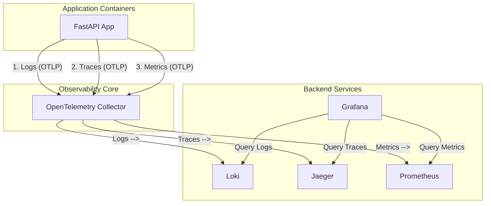

# FastAPI Telemetry with OpenTelemetry 🚀

This project demonstrates sending different types of telemetry from FastAPI applications using OpenTelemetry to backend systems.

- [FastAPI Telemetry with OpenTelemetry 🚀](#fastapi-telemetry-with-opentelemetry-)
  - [Observability Stack Overview 🕵️‍♂️](#observability-stack-overview-️️)
  - [Summary of Service Functionalities ⚙️](#summary-of-service-functionalities-️)
    - [OpenTelemetry Collector 📡](#opentelemetry-collector-)
    - [Jaeger 🔍](#jaeger-)
    - [Prometheus 📊](#prometheus-)
    - [Loki 🗂️](#loki-️)
    - [Grafana 📈](#grafana-)
  - [🗂️ How the Data Division Works](#️-how-the-data-division-works)
  - [📈 Diagram of the Observability Stack](#-diagram-of-the-observability-stack)
    - [🧠 Diagram Explanation](#-diagram-explanation)
  - [How to Launch the Observability Stack Services 🚀🛠️](#how-to-launch-the-observability-stack-services-️)
    - [Best practices applied](#best-practices-applied)
  - [Conclusion 🏁](#conclusion-)
  
---

## Observability Stack Overview 🕵️‍♂️

In the **observability** folder, you'll find the `docker-compose.yml` file defining the services of the OpenTelemetry observability stack. The architecture is designed so that the OpenTelemetry Collector, here called **otel-collector**, acts as an intermediary receiving different telemetry types (traces, metrics, and logs) and forwarding them to the respective backend systems.

---

## Summary of Service Functionalities ⚙️

Below is a brief overview of each key service: OpenTelemetry Collector, Jaeger, Prometheus, Loki, and Grafana.

### OpenTelemetry Collector 📡

**Main Role:** Acts as a mediator to collect, process, and export telemetry data (traces, metrics, logs) from instrumented applications to different backends.

**Key Components:**

- **Receivers:** Accept telemetry data in various formats.
- **Processors:** Transform and filter data before forwarding.
- **Exporters:** Send processed data to target backends.

**Advantages:** Decouples instrumentation logic from apps, simplifies observability, and avoids needing multiple agents.

---

### Jaeger 🔍

**Main Role:** Distributed tracing platform for monitoring and troubleshooting microservice architectures.

**Features:**

- Monitoring distributed workflows.
- Identifying performance bottlenecks.
- Analyzing service dependencies.
- Trace visualization for debugging.

**How to View Traces in Jaeger?**

Once your application traces reach the Jaeger container, you can open the Jaeger UI at:

`http://localhost:16686`

- Use the search menu in the top left corner.
- Select your service name (e.g., `FastAPIApp`) in the dropdown. If it’s missing, traces may not have arrived yet.
- Choose specific operations (like HTTP endpoints `/items/{item_id}`) if desired.
- Set the time range (e.g., "Last 1 Hour").
- Click **Find Traces** to see the list.
- Click on any trace to view detailed spans, durations, and metadata—critical info for debugging bottlenecks and performance issues.

---

### Prometheus 📊

**Main Role:** Monitoring system and time-series database collecting app and system metrics.

**Features:**

- Multidimensional data model with named metrics and key-value pairs.
- Powerful PromQL query language for complex queries.
- Efficient storage and alerting based on defined conditions.

---

### Loki 🗂️

**Main Role:** Logs aggregation system enabling efficient log storage and querying.

**Features:**

- Built to integrate with Grafana for log visualization.
- Stores logs without indexing, reducing resource usage.
- Log querying with PromQL-like query language.

---

### Grafana 📈

**Main Role:** Data visualization and analytics platform for creating interactive dashboards to monitor metrics, logs, and traces.

**Features:**

- Multiple data sources support including Prometheus and Loki.
- Alerting tools for notifications via various channels.
- Customizable dashboards sharable among teams.
- Integration with incident and alert management tools.

---

## 🗂️ How the Data Division Works

The OpenTelemetry Collector is the core component that makes your observability stack work. It acts as a central hub for all your telemetry data, including traces, metrics, and logs. Its primary job is to receive data from your application and then forward it to the correct backend system for storage and visualization. This modular approach allows you to use the best tool for each type of telemetry.

In our setup, the data is handled as follows:

- **Traces**: Your FastAPI application generates traces for HTTP requests. These traces are sent to the OpenTelemetry Collector. Based on the traces pipeline configured in otel-collector-config.yaml, the collector forwards them to the Jaeger exporter. Jaeger is a specialized tool for visualizing distributed traces, which helps you track a single request as it moves through multiple services and components.

- **Metrics**: Your application also generates metrics, such as request response times and error counts. These metrics are sent to the OpenTelemetry Collector. The collector, using the metrics pipeline, exposes them via its Prometheus exporter. Prometheus then scrapes (pulls) these metrics from the collector and stores them for monitoring and alerting.

- **Logs**: Your application's log messages are also sent to the OpenTelemetry Collector. The collector's logs pipeline is configured to forward them to Loki, un sistema de agregación de logs de Grafana. Loki está diseñado para almacenar y consultar logs de manera eficiente, lo que te permite buscar y analizar eventos de tu aplicación.

## 📈 Diagram of the Observability Stack

The following diagram illustrates how your FastAPI application, the OpenTelemetry Collector, and the backend services (Loki, Jaeger, and Prometheus) are interconnected within your Docker environment. It shows the flow of traces, metrics, and logs from your application through the collector to their final destinations.



### 🧠 Diagram Explanation

- **FastAPI App**: This is your application, the source of all telemetry data. It's instrumented with the OpenTelemetry SDK to automatically generate logs, traces, and metrics.

- **OpenTelemetry Collector**: This acts as the central hub. All telemetry data from the FastAPI app is sent here first. The collector then processes and routes the data based on its configuration. This is where the pipelines for traces, metrics, and logs are defined.

- **Loki**: Receives and stores logs from the collector. It is optimized for storing and querying logs.

- **Jaeger**: Receives and stores traces. Its primary function is to help you visualize and analyze the flow of requests across different services.

- **Prometheus**: Receives and stores metrics. It pulls or "scrapes" metrics data from the collector.

- **Grafana**: This is your visualization layer. It connects to Loki, Prometheus, and Jaeger as data sources. You can use Grafana to create dashboards, explore metrics, analyze traces, and search for logs, all from a single interface.

## How to Launch the Observability Stack Services 🚀🛠️

The `docker-compose.yml` file is located in the root of this folder 🗂️ and defines all the services for the OpenTelemetry observability stack 📡.

To start all the services defined in this file, open a terminal 🖥️ in the root folder and run:


```bash
docker-compose up -d
```

### Best practices applied
 - **container_name** 🏷️: adds clarity when inspecting containers.
 - **persistent volumes** 💾: to avoid losing historical data from metrics (Prometheus), dashboards (Grafana), and logs (Loki).
 - **config mounts as :ro**🔒: prevents the container from modifying local configuration files.
 - **depends_on**⏳: ensures Grafana does not start before Prometheus and Loki.
 - **environment variables in Grafana** 🔑: set an initial user and password (you can move this to .env for better security).
 - **explicit network names** 🌐: good practice for observability services.

where:

- The `up` command creates and starts the containers 🐳.
- The `-d` flag runs the containers in detached mode (in the background) 💤.
- This command will start all services including the OpenTelemetry Collector 📡, Jaeger 🔍, Prometheus 📊, Loki 🗂️, and Grafana 📈.

To stop the stack, run:

```bash
docker-compose down
```

This will stop and remove all the containers 🛑 created by the compose file but will preserve data volumes 💾 unless explicitly removed.

---

If you want to view logs from the running services, use:

```bash
docker-compose logs -f
```


This allows you to follow the logs in real time 📜⏳.

---

With these commands, you can easily launch 🚀, monitor 👀, and stop ⏹️ the full observability stack defined in the `docker-compose.yml` at the project root 📁.


## Conclusion 🏁

This set of services forms a robust observability stack enabling developers and operations teams to monitor, analyze, and optimize application and system performance effectively. Each service plays a specific role which, when integrated, provides comprehensive visibility into application health and behavior.
